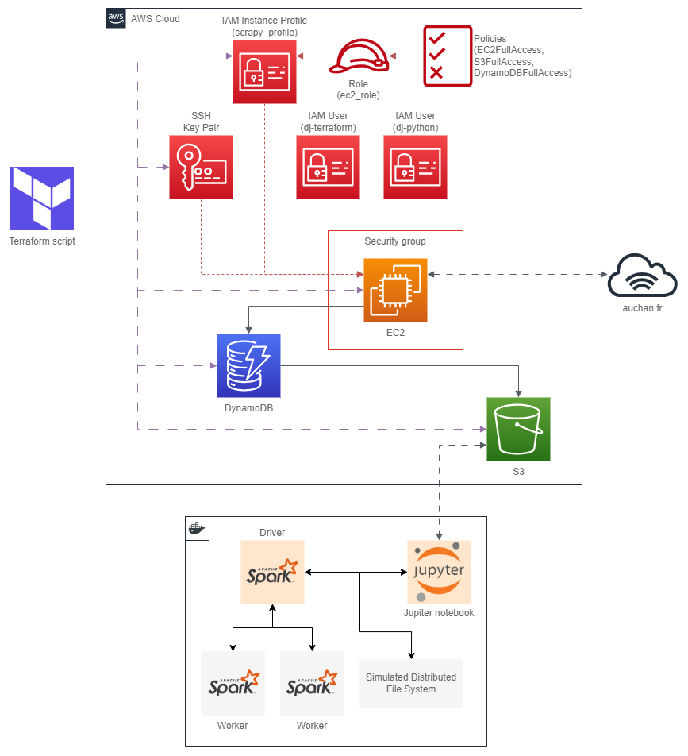

# OT6 Cloud Project



## To run the analytics

Create an .env with these credentials:

```bash
SECRET_ACCESS_KEY=XXXXXXXXXXXXXXXXXX
ACCESS_KEY_ID=XXXXXXXXXX
```

Run
```bash
docker compose up --scale spark-worker=3
```

Open:
- http://localhost:8888/notebooks/work/analytics.ipynb
- http://localhost:8888/notebooks/work/index2mongo.ipynb

Stop using
```bash
docker compose down -v --remove-orphans
```


### Cluster overview

| Application     | URL                                      | Description                                                          |
| --------------- | ---------------------------------------- | -------------------------------------------------------------------- |
| JupyterNotebook | [localhost:8888](http://localhost:8888/) | Jupyter notebooks                                                    |
| Web UI          | [localhost:4040](http://localhost:4040/) | To monitor the status and resource consumption of your Spark cluster |
| Spark Master    | [localhost:8080](http://localhost:8080/) | Spark Driver                                                         |
| Spark Worker I  |                                          | Spark Worker node                                                    |
| Spark Worker II |                                          | Spark Worker node                                                    |

### Stack
- [Spark 3.3.0](https://spark.apache.org/docs/3.3.0/) 
- [PySpark 3.3.1](https://spark.apache.org/docs/3.3.1/api/python/reference/index.html) 


## To run the spider
Create a virtual env

```bash
python3 -m venv env
```

```bash
source env/bin/activate
```

```bash
pip -r requirements.txt
```

Create an .env file in ``./project/project/`` folder with these credentials:

```bash
SECRET_ACCESS_KEY=XXXXXXXXXXXXXXXXXX
ACCESS_KEY_ID=XXXXXXXXXX
```
